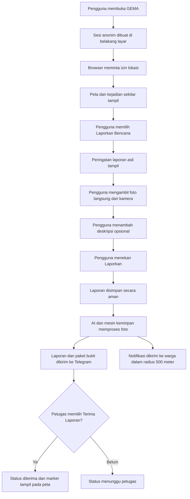
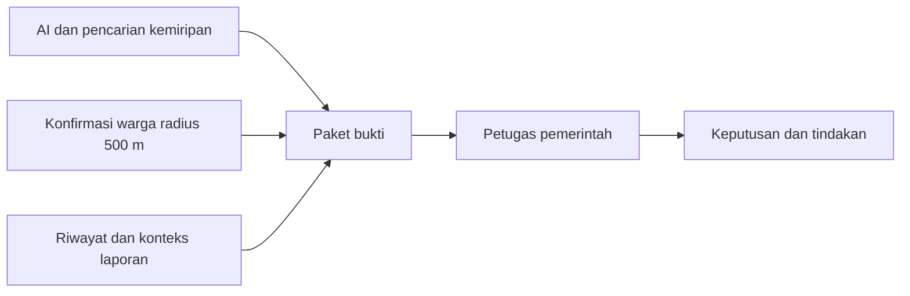

# Spesifikasi Perubahan dan Implementasi GEMA

Status: **disepakati untuk diimplementasikan di branch `dev`**  
Tanggal pembaruan: **4 Oktober 2026**  
Acuan tampilan dan alur utama: **branch `main`**  
Acuan fondasi keamanan dan ketahanan: **branch `dev`**

## 1. Tujuan

GEMA adalah web app pelaporan bencana yang dapat digunakan dengan cepat ketika warga melihat kejadian seperti kebakaran, banjir, atau tanah longsor. Pengguna tidak melewati formulir login. Sistem membuat sesi anonim di belakang layar, meminta lokasi perangkat, menampilkan peta sekitar, dan menyediakan pelaporan berbasis foto dari kamera.

Perubahan ini mempunyai empat tujuan utama:

1. Mempertahankan alur dan tampilan sederhana seperti pada branch `main`.
2. Mengurangi spam laporan melalui cooldown yang diterapkan di server.
3. Memberikan bukti kepada petugas jika foto pernah digunakan di GEMA atau ditemukan di internet.
4. Melibatkan warga dalam radius 500 meter sebagai sumber konfirmasi tambahan tanpa menggantikan keputusan petugas.

## 2. Prinsip produk

- Kecepatan pelaporan adalah prioritas. Tidak ada halaman login bagi warga.
- Sesi anonim Supabase tetap dibuat di belakang layar agar setiap tindakan mempunyai identitas server yang dapat diaudit.
- Foto laporan hanya dapat diambil menggunakan kamera pada saat pelaporan. UI tidak menyediakan galeri atau unggah berkas.
- AI memberikan analisis dan bukti pendukung. AI tidak menentukan bahwa suatu laporan pasti benar atau pasti palsu.
- Suara warga sekitar merupakan bukti tambahan. Keputusan operasional akhir tetap berada pada petugas.
- Petugas menerima laporan melalui Telegram. Dashboard pemerintah berfungsi sebagai riwayat dan pemantauan, bukan sebagai antrean moderasi kedua.
- Satu laporan yang diterima petugas ditampilkan sebagai marker berstatus pada peta. Heatmap hanya digunakan jika terdapat beberapa laporan independen yang membentuk kepadatan kejadian.
- Kegagalan AI, pencarian web, push notification, atau Telegram tidak boleh menghilangkan laporan yang sudah dikirim warga.

## 3. Sumber implementasi dari branch

### 3.1 Yang diambil dari `main`

- Susunan halaman utama dan pengalaman peta sebagai layar pertama.
- Permintaan lokasi perangkat saat pengguna membuka aplikasi.
- Tombol utama **Laporkan Bencana**.
- Pengalaman kamera yang sederhana.
- Struktur visual form laporan, marker peta, detail laporan, dashboard warga, dan dashboard pemerintah.
- Aset logo, ikon bencana, ikon utilitas, dan aset Figma yang sudah ada.
- Format awal pesan Telegram dan tombol **TERIMA LAPORAN**.

### 3.2 Yang dipertahankan dari `dev`

- Supabase anonymous sign-in dan validasi JWT di backend.
- Penyimpanan foto privat, validasi ukuran/format gambar, dan penghapusan metadata yang tidak diperlukan.
- Idempotency agar retry tidak membuat laporan dan pesan Telegram ganda.
- Outbox dan retry untuk pengiriman Telegram serta push notification.
- SHA-256 untuk foto yang sama persis dan perceptual hash untuk foto yang mirip.
- Pencatatan audit, quota di database, pemeriksaan lokasi, dan perlindungan akses backend.
- Service worker, subscription push, dan fondasi notifikasi yang sudah tersedia.

### 3.3 Aturan pemindahan

- Jangan melakukan checkout atau penyalinan seluruh folder `main` ke `dev`.
- Port tampilan dan perilaku secara selektif karena penimpaan seluruh folder akan menghapus fondasi keamanan `dev`.
- Aset publik `main` saat ini sudah tersedia di `dev`. `dev` hanya menambahkan `frontend/public/sw.js`, sehingga aset tidak perlu disalin ulang kecuali pemeriksaan hash menemukan perbedaan.
- Jangan mengubah branch `main`. Semua implementasi dilakukan pada branch `dev`.
- Pertahankan perubahan lokal yang sudah ada, termasuk peringatan laporan palsu pada `ReportForm.tsx` dan dokumen ini.

## 4. Peran pengguna

| Peran | Akses dan tanggung jawab |
| --- | --- |
| Warga pelapor | Membuka aplikasi tanpa login, memberi izin lokasi, mengambil foto, menambah deskripsi, dan mengirim laporan. |
| Warga sekitar | Menerima notifikasi jika lokasi pemantauannya berada maksimal 500 meter dari laporan, lalu memilih **Konfirmasi** atau **Palsu**. |
| Petugas pemerintah | Menerima laporan dan seluruh bukti melalui Telegram, kemudian memilih menerima laporan dan melakukan tindakan lapangan. |
| Dashboard pemerintah | Menampilkan riwayat laporan, status, bukti AI, bukti kemiripan, suara warga, dan tindakan petugas. Tidak menjadi tempat persetujuan tambahan. |

## 5. Alur utama warga

### 5.1 Saat membuka aplikasi

1. Frontend membuat atau memulihkan sesi anonim Supabase tanpa menampilkan UI login.
2. Aplikasi meminta izin lokasi perangkat melalui dialog sistem browser/perangkat.
3. Jika lokasi diberikan, peta fokus pada posisi pengguna dan menampilkan laporan di sekitarnya.
4. Jika lokasi ditolak atau gagal, tampilkan penjelasan singkat, tombol mencoba kembali, dan pilihan area manual. Area manual tidak boleh dinyatakan sebagai posisi langsung pengguna.
5. Lokasi harus menampilkan waktu pembaruan dan status akurasinya.

### 5.2 Membuat laporan

1. Pengguna menekan **Laporkan Bencana**.
2. Tampilkan pesan:

   > **Harap membuat laporan yang benar dan sesuai dengan keadaan di lapangan. Pelaku yang dengan sengaja membuat laporan palsu dapat dikenai konsekuensi sesuai hukum yang berlaku.**

3. Kamera dibuka langsung. Tidak ada tombol galeri, file picker, drag-and-drop, atau pilihan gambar lama.
4. Setelah foto diambil, pengguna dapat mengambil ulang foto.
5. Pengguna melihat lokasi laporan dan dapat menambahkan deskripsi opsional.
6. Pengguna menekan **Laporkan** satu kali. Tidak diperlukan tombol **Analisis Foto** terpisah.
7. UI memperlihatkan tahapan yang mudah dipahami: menyimpan laporan, memeriksa foto, dan mengirim kepada petugas.
8. Setelah berhasil, tampilkan ID laporan dan status **Menunggu petugas**.
9. Retry dengan operasi yang sama tidak boleh membuat laporan baru.

### 5.3 Batas kamera

- Pembatasan kamera pada UI mengurangi penyalahgunaan, tetapi tidak membuktikan foto pasti diambil dari kejadian nyata.
- Pengguna masih dapat memotret layar lain atau memanggil API tanpa menggunakan UI.
- Karena itu, validasi backend dan pemeriksaan kemiripan tetap wajib.
- Jika perangkat tidak mempunyai kamera atau izin kamera ditolak, tampilkan kegagalan yang jelas dan tombol mencoba kembali. Versi ini tidak menyediakan fallback galeri.

## 6. Cooldown dan pencegahan spam

### 6.1 Aturan utama

- Setiap identitas anonim hanya dapat menerbitkan **satu laporan setiap 3 menit**.
- Cooldown diterapkan oleh backend menggunakan penyimpanan bersama/database.
- Waktu tunggu dikembalikan oleh API dan ditampilkan pada UI.
- Reload halaman, mengganti tab, atau memanggil API secara langsung tidak boleh melewati cooldown.
- Retry idempoten dari laporan yang sama tidak dihitung sebagai laporan baru.

### 6.2 Sinyal jaringan

- Backend dapat menggunakan HMAC/hash alamat IP publik sebagai sinyal tambahan.
- IP bukan identitas utama karena satu jaringan dapat dipakai banyak warga dan IP dapat berubah.
- Batas jaringan harus lebih longgar daripada batas identitas agar warga dalam satu kantor, kampus, atau Wi-Fi publik tetap dapat melapor.
- Jangan menyimpan IP mentah jika tidak dibutuhkan.

### 6.3 Penyalahgunaan lanjutan

- Catat pola laporan berulang, foto berulang, lokasi yang tidak konsisten, dan pembuatan banyak sesi dari jaringan yang sama sebagai risk flag.
- Risk flag diteruskan kepada petugas; risk flag tidak otomatis menjadi vonis hoaks.

## 7. Analisis AI dan pemeriksaan foto

AI mempunyai dua tanggung jawab yang terpisah.

### 7.1 Analisis kondisi lapangan

AI menjelaskan hal yang dapat diamati pada foto:

- jenis bencana yang terlihat;
- skala atau luas kejadian yang tampak;
- tingkat keparahan awal;
- objek atau area yang terdampak;
- indikator bahaya yang terlihat;
- keterbatasan atau ketidakpastian analisis.

AI tidak menentukan jumlah personel atau peralatan secara bebas. Jika rekomendasi operasional ditampilkan, rekomendasi berasal dari aturan yang telah disetujui instansi berdasarkan jenis dan tingkat kejadian.

### 7.2 Pemeriksaan laporan GEMA sebelumnya

Backend membandingkan foto baru dengan laporan non-demo yang sudah tersimpan:

1. SHA-256 untuk menemukan gambar yang sama persis.
2. Perceptual hash untuk menemukan gambar yang telah dikompresi, diubah ukuran, atau diedit ringan.
3. Ambang kemiripan harus dapat dikonfigurasi dan dievaluasi menggunakan dataset uji.
4. Hasil mengembalikan laporan paling relevan, bukan sekadar label **mirip**.

Setiap laporan pembanding minimal memuat:

| Informasi | Kegunaan bagi petugas |
| --- | --- |
| ID laporan | Membuka dan mengaudit laporan pembanding |
| Foto/thumbnail pembanding | Melihat bukti visual |
| Persentase atau kategori kemiripan | Memahami kekuatan sinyal |
| Waktu diamati dan waktu dikirim | Menilai apakah foto lama digunakan kembali |
| Lokasi dan jarak dari laporan baru | Membedakan kejadian sama dan penggunaan ulang lintas lokasi |
| Jenis bencana | Memeriksa konsistensi konteks |
| Status laporan terdahulu | Mengetahui apakah pernah diterima, ditutup, atau ditandai bermasalah |
| Alasan kecocokan | Sama persis, mirip visual, atau metadata lain |

### 7.3 Pemeriksaan sumber internet

- Gunakan adapter penyedia web image matching/reverse image search. Rekomendasi awal adalah Google Cloud Vision Web Detection, tetapi implementasi harus dapat mengganti provider.
- Simpan hasil sebagai bukti terstruktur: halaman sumber, URL, judul, tanggal publikasi jika tersedia, thumbnail, jenis kecocokan, dan skor kemiripan.
- Batasi jumlah hasil yang dikirim ke petugas, misalnya tiga hasil paling relevan, dengan tautan menuju detail lengkap.
- Hasil **ditemukan mirip di internet** berarti perlu pemeriksaan, bukan otomatis palsu.
- Tidak ditemukannya hasil tidak membuktikan foto asli.
- Jika provider tidak dikonfigurasi, timeout, atau gagal, laporan tetap diteruskan dengan status **Pemeriksaan internet belum tersedia**.

### 7.4 Status bukti yang digunakan

- **Tidak ditemukan kecocokan**
- **Foto sama dengan laporan GEMA sebelumnya**
- **Foto mirip dengan laporan GEMA sebelumnya**
- **Gambar mirip ditemukan di internet**
- **Pemeriksaan belum tersedia/gagal**
- **Perlu pemeriksaan petugas**

Hindari teks otomatis seperti **Laporan teridentifikasi palsu** tanpa keputusan petugas.

## 8. Paket informasi Telegram untuk petugas

Pesan Telegram harus tetap singkat pada bagian utama, tetapi menyertakan bukti yang dapat dibuka.

### 8.1 Isi pesan utama

- ID laporan.
- Jenis bencana.
- Keparahan awal.
- Lokasi dan tautan peta.
- Waktu pengamatan serta waktu pengiriman.
- Deskripsi warga.
- Ringkasan analisis visual AI dan tingkat keyakinan.
- Status pemeriksaan foto.
- Ringkasan suara warga: jumlah **Konfirmasi** dan **Palsu**.
- Status responder: **Menunggu petugas** atau **Diterima petugas**.

### 8.2 Bukti foto mirip

Jika ada kecocokan internal, pesan atau halaman detail petugas menampilkan maksimal tiga laporan teratas beserta foto pembanding, ID, waktu, lokasi, jarak, status, dan skor/alasan kemiripan.

Jika ada kecocokan web, tampilkan maksimal tiga sumber utama beserta tautan sumber, judul, tanggal jika tersedia, dan jenis kecocokannya.

### 8.3 Tombol petugas

- **TERIMA LAPORAN**: mencatat petugas dan waktu penerimaan, memperbarui pesan Telegram, serta membuat marker laporan terlihat pada peta publik.
- **LIHAT BUKTI**: membuka detail privat yang berisi foto asli, kecocokan internal, kecocokan web, dan suara warga.
- Status lanjutan seperti selesai atau tidak sesuai dapat ditambahkan pada detail petugas/Telegram dan harus masuk riwayat audit.

Callback Telegram harus memvalidasi secret webhook, chat, message ID, report ID, dan identitas responder yang diizinkan. Klik berulang bersifat idempoten.

## 9. Marker, pengelompokan, dan heatmap

- Laporan baru berstatus **Menunggu petugas** dan belum muncul sebagai marker umum pada peta.
- Penerima notifikasi sekitar tetap dapat membuka detail laporan yang diperlukan untuk verifikasi.
- Setelah petugas menekan **TERIMA LAPORAN**, marker muncul dengan status **Petugas menindaklanjuti**.
- Marker menggunakan jenis bencana dan tingkat keparahan yang telah diperiksa.
- Beberapa laporan yang berdekatan dalam ruang, waktu, dan jenis dapat ditautkan sebagai satu incident.
- Heatmap hanya menggambarkan kepadatan beberapa laporan/incident, bukan satu laporan yang diterima.
- Penggabungan laporan menyimpan hubungan ke seluruh laporan asal agar waktu, lokasi, foto, dan pelapornya tetap dapat diaudit.

## 10. Notifikasi dalam radius 500 meter

### 10.1 Penerima

- Notifikasi ditujukan kepada subscription aktif yang lokasi pemantauan terakhirnya berada pada jarak **maksimal 500 meter** dari lokasi laporan.
- Lokasi perangkat harus cukup baru dan mempunyai akurasi yang layak. Nilai awal yang disarankan: umur lokasi maksimal 5 menit dan akurasi maksimal 100 meter.
- Browser tidak menyediakan GPS latar belakang terus-menerus. Sistem menggunakan lokasi terakhir yang diberikan pengguna saat aplikasi aktif atau area pantauan yang dipilih pengguna.
- Izin lokasi dan izin notifikasi adalah dua izin perangkat yang berbeda dan harus dijelaskan secara singkat.

### 10.2 Isi notifikasi

- Gunakan bahasa **Ada laporan kebakaran di sekitar Anda**, bukan **Terjadi kebakaran**, selama belum dikonfirmasi petugas.
- Tampilkan jenis kejadian, perkiraan jarak, waktu, status verifikasi, dan tautan detail.
- Detail menyediakan foto yang aman untuk dilihat, deskripsi, perkiraan lokasi, dan tombol tanggapan.
- Jangan menampilkan identitas pelapor atau koordinat privat yang tidak diperlukan.

### 10.3 Pengiriman

- Simpan subscription secara privat.
- Gunakan outbox, deduplikasi per laporan/versi, retry terbatas, dan hapus/nonaktifkan subscription yang kedaluwarsa.
- Perubahan material seperti laporan diterima, diragukan, dipulihkan, atau ditutup dapat mengirim pembaruan kepada penerima sebelumnya.

## 11. Konfirmasi warga sekitar

### 11.1 Pilihan

- **Konfirmasi**: warga menilai kejadian benar berdasarkan keadaan sekitar.
- **Palsu**: warga telah memeriksa keadaan dan menilai laporan tidak sesuai.

Berikan penjelasan bahwa pilihan harus berdasarkan pengamatan atau pemeriksaan lapangan, bukan sekadar dugaan.

### 11.2 Syarat suara

- Pengguna mempunyai sesi anonim yang valid.
- Pengguna bukan pelapor dari laporan tersebut.
- Lokasi saat memberikan suara berada maksimal 500 meter dari lokasi laporan.
- Lokasi mempunyai waktu dan akurasi yang memenuhi syarat.
- Satu identitas hanya mempunyai satu suara aktif per laporan.
- Mengubah pilihan memperbarui suara lama dan tidak menambah jumlah orang.
- Semua perubahan suara masuk riwayat audit.
- Endpoint suara mempunyai rate limit dan perlindungan jaringan tambahan.

### 11.3 Aturan lebih dari lima suara Palsu

Laporan disembunyikan sementara dari peta/notice publik apabila seluruh kondisi berikut terpenuhi:

1. Minimal **6** perangkat/identitas unik yang memenuhi syarat memilih **Palsu**.
2. Jumlah suara **Palsu** lebih besar daripada jumlah suara **Konfirmasi**.
3. Suara tidak berasal dari pelapor dan lolos pemeriksaan radius, waktu lokasi, akurasi, dan pola penyalahgunaan.

Tindakan sistem:

- status bukti berubah menjadi **Diragukan oleh warga sekitar**;
- notifikasi baru dihentikan sementara;
- laporan dan seluruh bukti tetap tersimpan;
- Telegram diperbarui dengan jumlah suara serta peringatan untuk petugas;
- laporan tidak dihapus permanen;
- laporan dapat dipulihkan oleh bukti atau tindakan petugas.

Jika petugas telah menerima laporan atau tim telah bergerak, suara warga tidak otomatis membatalkan penanganan. Petugas tetap menerima pembaruan dan mengambil keputusan akhir.

## 12. Tiga lapisan pemeriksaan

1. **AI** menganalisis kondisi visual dan mencari kemiripan internal maupun web.
2. **Warga sekitar** memberikan bukti keadaan lapangan melalui Konfirmasi/Palsu.
3. **Petugas** menerima seluruh bukti dan menentukan tindakan serta status akhir.

## 13. Status laporan yang disarankan

| Status | Arti | Tampil di peta publik |
| --- | --- | --- |
| `draft` | Foto/input sudah disimpan tetapi belum dikirim | Tidak |
| `analyzing` | Analisis visual dan provenance sedang berjalan | Tidak |
| `pending_response` | Sudah dikirim ke petugas dan warga sekitar | Tidak sebagai marker umum |
| `community_disputed` | Minimal 6 suara Palsu yang memenuhi aturan | Tidak |
| `accepted` | Petugas menerima laporan | Ya |
| `resolved` | Penanganan selesai | Tidak pada peta aktif; tetap ada di riwayat |
| `refuted` | Petugas menyatakan laporan tidak sesuai | Tidak; tetap ada di riwayat |
| `expired` | Laporan melewati masa aktif | Tidak; tetap ada di riwayat |

Nama status database dapat disesuaikan dengan migrasi `dev`, tetapi makna produk di atas harus dipertahankan. Migrasi harus kompatibel dengan data lama dan bersifat append-only.

## 14. Dashboard pemerintah

- Mengikuti tampilan dashboard pemerintah pada `main` sebagai acuan visual.
- Menampilkan riwayat seluruh laporan beserta filter status, jenis, waktu, dan lokasi.
- Menampilkan status Telegram, petugas penerima, waktu penerimaan, hasil AI, kecocokan foto, sumber web, serta agregat suara warga.
- Tidak ada tahap persetujuan tambahan di dashboard.
- Keputusan responder berasal dari tombol Telegram atau endpoint petugas yang terautentikasi.
- Detail privat hanya dapat dibuka oleh role petugas yang diverifikasi server.

## 15. Privasi dan keamanan

- Warga tidak melihat halaman login, tetapi backend tetap memerlukan token anonim yang sah.
- Jangan menerima UUID lokal atau Bearer arbitrary sebagai identitas.
- Foto asli disimpan di bucket privat. Akses menggunakan signed URL berumur pendek sesuai peran.
- Hapus metadata EXIF yang tidak diperlukan sebelum penyimpanan/penayangan.
- Koordinat publik dibuat perkiraan. Koordinat lebih presisi hanya diberikan kepada petugas sesuai kebutuhan.
- Service key, token Telegram, kunci provider AI/web, dan VAPID private key hanya berada di backend/environment.
- Log tidak memuat token, IP mentah, signed URL, atau koordinat privat lengkap.
- Semua keputusan petugas, perubahan suara, perubahan status, dan retry delivery dicatat.
- Isi deskripsi dibatasi panjangnya, diperlakukan sebagai teks, dan tidak dirender sebagai HTML.

## 16. Ketahanan layanan

- Simpan laporan/draft sebelum memanggil AI atau provider eksternal.
- Jika AI gagal, kirim laporan dengan label **Analisis AI belum tersedia**.
- Jika pemeriksaan web gagal, kirim laporan dengan label **Pemeriksaan internet belum tersedia**.
- Jika Telegram gagal, laporan tetap tersimpan dan outbox mencoba kembali.
- Jika push gagal, kegagalan tidak menggagalkan laporan atau Telegram.
- Proses analisis dan pengiriman mempunyai timeout, retry terbatas, dan status yang dapat diaudit.
- Jangan mengirim Telegram atau push nyata dari automated test.

## 17. Kontrak data minimum

Implementasi dapat menyesuaikan skema yang ada, tetapi perlu mencakup data berikut:

- `reports`: identitas, author anonim, status, jenis, keparahan, deskripsi, lokasi privat/publik, waktu diamati/dikirim, status responder, risk flags, hasil AI, version.
- `report_media`: path privat, MIME, dimensi, SHA-256, perceptual hash, metadata sanitasi.
- `report_matches`: report asal, report pembanding, metode, skor/jarak hash, alasan, waktu dibuat.
- `web_image_matches`: report, provider, source URL, source page/title/date, thumbnail, match type, score.
- `community_votes`: report, voter, pilihan, lokasi/akurasi/waktu yang sudah divalidasi, eligibility, waktu dibuat/diubah.
- `community_vote_history`: riwayat perubahan suara.
- `push_subscriptions` dan `push_deliveries`.
- `notification_outbox` untuk Telegram dan push.
- `audit_events` untuk perubahan penting.
- `rate_limit_buckets` dan `idempotency_keys`.

## 18. Endpoint/perilaku minimum

Nama endpoint dapat mengikuti struktur `dev`, tetapi perilaku berikut harus tersedia:

- Membuat/memulihkan sesi anonim.
- Membuat draft dan mengunggah foto kamera.
- Mengirim laporan secara idempoten.
- Membaca status analisis dan hasil bukti.
- Membaca laporan sekitar berdasarkan lokasi yang valid.
- Membuat/menghapus subscription push.
- Memberikan atau mengganti suara Konfirmasi/Palsu.
- Mengambil detail laporan publik yang telah disanitasi.
- Mengambil detail privat petugas.
- Webhook Telegram untuk menerima laporan secara idempoten.
- Riwayat pemerintah read-only.

## 19. Urutan implementasi

### Tahap 1 — Baseline UI `main` di `dev`

- Pulihkan pengalaman beranda, peta, form kamera, detail, tracker, dan dashboard seperti `main` secara selektif.
- Sambungkan UI tersebut ke anonymous auth dan API aman milik `dev`.
- Terapkan satu tombol submit setelah foto dan deskripsi.
- Pastikan peringatan laporan palsu tampil.

### Tahap 2 — Spam dan kamera

- Ubah quota penerbitan menjadi satu laporan setiap 180 detik per identitas.
- Tambahkan batas jaringan yang lebih longgar dan respons `retry_after`.
- Hapus seluruh opsi galeri dari UI.
- Pertahankan validasi media backend, idempotency, dan bucket privat.

### Tahap 3 — Analisis dan provenance

- Pisahkan hasil analisis visual dari hasil provenance.
- Kembalikan detail laporan internal yang cocok.
- Tambahkan adapter web image matching dengan fallback ketika tidak dikonfigurasi.
- Bangun tampilan bukti privat untuk petugas.

### Tahap 4 — Telegram dan status peta

- Perluas pesan Telegram dengan ringkasan bukti.
- Tambahkan tombol lihat bukti dan pertahankan tombol terima.
- Saat diterima, ubah status dan tampilkan marker pada peta.
- Pertahankan outbox, retry, validasi webhook, dan audit.

### Tahap 5 — Notifikasi dan suara warga

- Gunakan push subscription `dev` dengan radius tetap 500 meter.
- Ubah pilihan observation menjadi Konfirmasi/Palsu sesuai istilah produk.
- Validasi radius, freshness, akurasi, keunikan, dan larangan self-vote.
- Terapkan aturan 6 suara Palsu yang mendominasi.
- Kirim pembaruan kepada petugas dan penerima terdahulu.

### Tahap 6 — Dashboard, grouping, dan penyelesaian

- Jadikan dashboard pemerintah riwayat read-only.
- Tambahkan relasi laporan mirip/incident tanpa menghilangkan laporan asal.
- Terapkan marker dan heatmap sesuai makna yang benar.
- Lengkapi status selesai, tidak sesuai, kedaluwarsa, audit, dan metrik.

## 20. Kriteria penerimaan utama

1. Pengguna baru dapat membuka aplikasi, memberi izin lokasi, melihat peta, mengambil foto, menambah deskripsi, dan mengirim laporan tanpa melihat form login.
2. UI tidak menyediakan cara memilih foto dari galeri.
3. Laporan kedua dari identitas yang sama sebelum tiga menit ditolak backend dengan sisa waktu yang jelas.
4. Retry request yang sama tidak membuat laporan atau pesan Telegram ganda.
5. Foto yang sama/mirip menghasilkan daftar laporan pembanding lengkap, bukan label tanpa bukti.
6. Kecocokan internet menampilkan sumber dan tidak otomatis memberi vonis palsu.
7. Kegagalan AI/web tidak menghilangkan laporan.
8. Telegram menampilkan analisis, bukti provenance, suara warga, dan tombol terima.
9. Marker umum baru muncul setelah laporan diterima petugas.
10. Perangkat dengan lokasi valid dalam radius 500 meter menerima notice; perangkat di luar radius tidak.
11. Pelapor tidak dapat memberi suara pada laporannya sendiri.
12. Satu identitas hanya dihitung sekali walaupun mengubah pilihan.
13. Enam suara Palsu hanya menyembunyikan laporan jika lebih banyak daripada Konfirmasi dan seluruh suara memenuhi syarat.
14. Laporan yang sudah diterima petugas tidak otomatis dibatalkan oleh suara warga.
15. Dashboard pemerintah menampilkan riwayat dan bukti tanpa menjadi persetujuan kedua.
16. Foto dan koordinat presisi tidak terbuka melalui endpoint publik.

## 21. Pengujian yang diperlukan

- Unit test quota 180 detik, retry-after, dan batas jaringan.
- Unit/integration test SHA-256, perceptual hash, urutan/top match, dan false positive dasar.
- Contract test provider web: sukses, tidak ada hasil, timeout, kredensial tidak tersedia, dan respons rusak.
- Test idempotency laporan, Telegram callback, outbox, dan push delivery.
- Test radius tepat di bawah, tepat pada, dan di atas 500 meter.
- Test lokasi basi, akurasi buruk, self-vote, pergantian suara, dan banyak sesi mencurigakan.
- Test aturan 6 Palsu vs jumlah Konfirmasi.
- Test akses publik vs akses petugas untuk foto dan koordinat.
- Browser test alur kamera menggunakan media mock, bukan file picker produksi.
- Browser test alur utama mobile dan desktop.
- Verifikasi manual Telegram hanya pada environment staging yang memang dikonfigurasi.

## 22. Metrik keberhasilan dan guardrail

### Metrik utama

- Persentase laporan yang berhasil tersimpan dan sampai ke antrean Telegram.
- Waktu dari tombol **Laporkan** sampai laporan tersimpan.
- Persentase laporan dengan bukti provenance yang selesai diproses.
- Persentase notifikasi radius yang menghasilkan tanggapan warga.

### Guardrail

- Laporan asli yang salah disembunyikan oleh sistem.
- Foto/koordinat privat yang terbuka ke publik.
- Duplikasi laporan atau Telegram akibat retry.
- Warga sah yang terblokir karena memakai jaringan bersama.
- Keterlambatan pengiriman karena AI/provider web.

## 23. Hal yang tidak dijanjikan

- Sistem tidak dapat menjamin kebenaran laporan 100 persen.
- Tidak ada hasil pencarian internet bukan bukti keaslian.
- Camera-only tidak mencegah pengguna memotret layar lain.
- IP tidak digunakan sebagai identitas seseorang.
- AI tidak menggantikan petugas dan tidak menentukan tindakan operasional final.
- Push web tidak berarti lokasi GPS perangkat dipantau terus-menerus ketika browser tertutup.

## 24. Keputusan konfigurasi awal

| Konfigurasi | Nilai awal |
| --- | --- |
| Cooldown laporan | 180 detik per identitas anonim |
| Radius notice dan suara | 500 meter |
| Minimum suara Palsu | 6 identitas unik dan eligible |
| Syarat dominasi | Palsu > Konfirmasi |
| Umur lokasi untuk suara | Maksimal 5 menit |
| Akurasi lokasi untuk suara | Maksimal 100 meter |
| Hasil kecocokan pada Telegram | Maksimal 3 internal + 3 web |
| Foto | Kamera langsung saja |
| Galeri | Tidak tersedia |
| Keputusan akhir | Petugas |

Nilai akurasi, freshness, ambang perceptual hash, dan jumlah hasil harus menjadi konfigurasi backend agar dapat disesuaikan setelah uji lapangan.

## 25. Pertanyaan yang tidak menghalangi implementasi

- Redaksi peringatan hukum perlu ditinjau pihak yang memahami hukum Indonesia sebelum peluncuran publik.
- Kredensial dan biaya provider web image matching perlu ditentukan. Sampai tersedia, sistem berjalan dengan pemeriksaan internal dan status provider belum tersedia.
- Daftar akun Telegram responder yang diizinkan perlu disediakan sebelum staging terhubung ke grup nyata.
- Kebijakan retensi foto, lokasi presisi, dan bukti web perlu disepakati sebelum penggunaan produksi.

