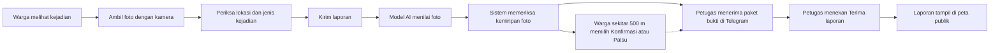
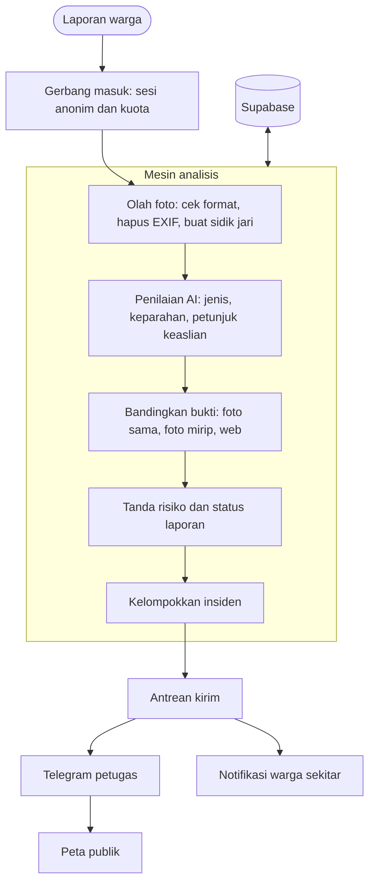

# GEMA (Gerakan Evaluasi dan Monitoring Ancaman)

GEMA adalah aplikasi web untuk melaporkan dan memantau kejadian bencana langsung dari warga: banjir, tanah longsor, dan kebakaran. Warga memotret kejadian, model AI menilai isi foto, sistem memeriksa apakah foto itu pernah dipakai pada laporan lain, lalu paket bukti diteruskan ke petugas. Warga di sekitar lokasi membantu dengan memilih Konfirmasi atau Palsu.


**Tim Labtek V Ijo Lumut Kya, Institut Teknologi Bandung**

- Juan Oloando Simanungkalit
- Ariel Sitorus Cornelius
- Naomi Azzahra
- Wa Ode Amerta Lambelu Jamaluddin
- Endda Tsa Azzahra Syaifur

## Daftar isi

- [Fitur utama](#fitur-utama)
- [Alur pengguna](#alur-pengguna)
- [Tech stack](#tech-stack)
- [Arsitektur](#arsitektur)
- [Struktur repository](#struktur-repository)
- [Cara menjalankan](#cara-menjalankan)
- [Pengujian](#pengujian)
- [Evaluasi model AI](#evaluasi-model-ai)
- [Deploy](#deploy)
- [Dokumentasi lanjutan](#dokumentasi-lanjutan)

## Fitur utama

- Laporan tanpa login. Sesi anonim dibuat di belakang layar, dan foto hanya dapat diambil langsung dari kamera.
- Peta penuh dengan pencarian kota atau jenis bencana, mode status laporan, dan mode kepadatan pelapor.
- Penilaian foto oleh model AI: jenis bencana, tingkat keparahan visual, tingkat keyakinan, serta petunjuk bila foto tampak seperti tangkapan layar, gambar buatan, atau hasil edit.
- Pemeriksaan kemiripan foto dengan laporan lain di GEMA, dan pencarian gambar di web bila penyedianya diaktifkan.
- Laporan yang mirip di lokasi dan waktu yang berdekatan dikelompokkan menjadi satu insiden.
- Petugas menerima paket bukti lewat Telegram dan menekan tombol terima. Laporan baru tampil di peta publik setelah diterima.
- Warga dalam radius 500 meter dapat memilih Konfirmasi atau Palsu sebagai bukti tambahan. Enam suara Palsu yang lebih banyak daripada Konfirmasi menahan laporan yang belum diterima petugas.
- Draft laporan tersimpan di perangkat selama tujuh hari dan terkirim saat aplikasi dibuka kembali.
- Chatbot GEMA AI menjawab jumlah dan ringkasan laporan, pengetahuan umum bencana, dan cara kerja GEMA.
- Pembatasan penyalahgunaan: satu laporan setiap 3 menit per akun anonim, dengan batas tambahan per jaringan.

## Alur pengguna



Singkatnya, warga melapor dalam beberapa langkah, sistem menyiapkan bukti, dan petugas yang memutuskan. Hasil AI membantu menilai isi foto, bukan membuktikan kebenaran kejadian, dan GEMA bukan sistem peringatan resmi.

## Tech stack

| Lapisan | Teknologi | Fungsi |
| --- | --- | --- |
| Antarmuka | Next.js 16, React 19, TypeScript, Tailwind CSS 4 | Halaman warga, form laporan, chatbot |
| Peta | Leaflet dan OpenStreetMap | Marker laporan, kepadatan pelapor, pilih lokasi |
| Backend | FastAPI (Python 3.11 ke atas) | API laporan, aturan bisnis, kuota, worker pengiriman |
| Database dan penyimpanan | Supabase (PostgreSQL, Auth, Storage) | Data laporan, sesi anonim, foto privat |
| Model AI | Model visi-bahasa (saat ini Gemini 3.1 Flash-Lite lewat Google AI API) | Menilai foto dan menjawab chatbot. Penyedia dapat diganti di satu fungsi |
| Pencarian gambar web | Google Cloud Vision Web Detection (opsional) | Mencari foto yang sama di internet |
| Notifikasi | Telegram Bot API, Web Push (VAPID) | Paket bukti ke petugas, pemberitahuan ke warga |
| Pengujian | unittest, node:test, Playwright, PostgreSQL lokal | Test unit, peramban, dan database |
| Deploy | Railway | Dua layanan: frontend dan backend |

## Arsitektur



## Struktur repository

```text
.
├── frontend/                  Aplikasi web (Next.js)
│   ├── src/app/               Halaman: peta, ringkasan, form laporan, panduan, hotline, tentang
│   ├── src/components/        Komponen antarmuka, peta, chatbot
│   ├── src/lib/               Klien API, sesi, lokasi, aturan tampilan
│   ├── public/                Logo, ikon, service worker
│   └── tests/
│       ├── unit/              Test unit (node:test)
│       └── e2e/               Test peramban (Playwright)
├── backend/                   API (FastAPI)
│   ├── app/                   Kode aplikasi: api, services, schemas, deps, core
│   ├── migrations/            Migrasi database 001 sampai 011
│   ├── scripts/               Skrip operasional: data demo, cek kesiapan, webhook, evaluasi AI
│   └── tests/
│       ├── unit/              Test Python dengan layanan luar yang ditiru
│       ├── sql/               Uji migrasi, transaksi, dan konkurensi PostgreSQL
│       ├── fixtures/          Foto uji (tidak ikut repository) dan kunci jawaban
│       └── output/            Hasil evaluasi AI
├── docs/
│   ├── fik-fair/              Spesifikasi, hasil pengujian, operasional, submission
│   ├── perencanaan/           Rencana implementasi, revisi, notulen, perubahan dari proposal
│   └── pitch/                 Naskah pitching dan panduan bisnis
├── LICENSE
└── README.md
```

## Cara menjalankan

Prasyarat: Node.js 24, Python 3.11 ke atas, dan sebuah project Supabase.

**1. Siapkan Supabase.** Jalankan berkas di `backend/migrations/` secara berurutan dari 001 sampai 011 lewat SQL Editor. Aktifkan Anonymous sign-ins di menu Authentication. Detail ada di [panduan operasional](docs/fik-fair/operasional.md).

**2. Isi variabel lingkungan.** Salin `backend/.env.example` menjadi `backend/.env` dan `frontend/.env.example` menjadi `frontend/.env.local`. Isi alamat dan kunci Supabase, `MODEL_API_KEY`, serta `RATE_LIMIT_SALT` (teks acak). Kunci rahasia hanya untuk backend. Kunci publishable boleh di frontend.

**3. Jalankan backend** dari folder `backend`:

```bash
python -m venv .venv
# Windows: .venv\Scripts\activate    Linux atau macOS: source .venv/bin/activate
pip install -r requirements.txt
python -m uvicorn app.main:app --reload --port 8000 --no-access-log
```

**4. Jalankan frontend** dari folder `frontend`:

```bash
npm ci
npm run dev
```

Buka http://localhost:3000. Pemeriksaan backend ada di http://localhost:8000/health.

**5. Data demo (opsional).** Untuk mengisi peta dengan titik simulasi, jalankan dari folder `backend`, lalu set `DEMO_SHOWCASE=true` di `backend/.env` dan jalankan ulang backend:

```bash
DEMO_MODE=true python -m scripts.seed_demo --showcase
```

Titik simulasi kedaluwarsa dalam 12 jam, jadi jalankan ulang perintah itu sebelum demo. Jangan nyalakan `DEMO_SHOWCASE` pada layanan yang dipakai publik.

Skrip bantu lain, semuanya dari folder `backend`:

```bash
python -m scripts.check_readiness --live          # cek konfigurasi dan skema database
python -m scripts.set_telegram_webhook https://HOST-BACKEND
python -m scripts.evaluasi_ai                     # evaluasi model pada foto uji
```

## Pengujian

Dari folder `backend`:

```bash
python -m unittest discover -s tests/unit -t .
python -m tests.unit.test_rules
python -m tests.unit.test_analyze
```

Dari folder `frontend`:

```bash
npm test
npm run lint
npm run build
npx playwright install chromium
npm run test:e2e
```

Uji database memakai PostgreSQL lokal sekali pakai: `backend/tests/sql/run-postgres.ps1`. Penjelasan tiap folder ada di [backend/tests/README.md](backend/tests/README.md). Test otomatis memakai layanan luar yang ditiru, jadi tidak menggantikan uji pengguna atau uji layanan nyata.

## Evaluasi model AI

Model yang dipakai hanya diberi prompt dan skema keluaran terstruktur. Model ini tidak di-fine-tune. Jawaban chatbot dan angka laporan selalu diambil dari data nyata, bukan dikarang model.

Evaluasi awal memakai 3 foto (satu banjir, satu kebakaran, satu longsor) dengan kunci jawaban yang ditentukan lewat tinjauan manual sebelum foto dikirim ke model. Hasilnya: akurasi jenis bencana 3 dari 3 dan F1 makro 1,0. Karena jumlah foto sangat kecil, angka ini hanya menunjukkan bahwa alurnya bekerja pada kasus yang jelas dan bukan tolok ukur statistik. Rincian dan cara mengulangnya ada di [backend/tests/output/hasil_evaluasi.md](backend/tests/output/hasil_evaluasi.md).

## Deploy

Aplikasi dipasang sebagai dua layanan Railway: akar `frontend/` dan akar `backend/`. Variabel `NEXT_PUBLIC_*` dibaca saat build, jadi bangun ulang frontend setelah menggantinya. Pada produksi, isi `CORS_ORIGINS`, `RATE_LIMIT_SALT`, dan kunci layanan di backend, gunakan `DEMO_MODE=false` dan `NEXT_PUBLIC_DEMO_MODE=false`, serta jalankan semua migrasi lebih dulu. Alamat demo sebelumnya adalah https://amusing-communication-production-abe3.up.railway.app/ dan masih memakai versi lama sampai cabang terbaru dipasang. Langkah pemeriksaan sebelum rilis ada di [panduan operasional](docs/fik-fair/operasional.md).

## Dokumentasi lanjutan

- [Indeks dokumentasi](docs/README.md)
- [Spesifikasi dan hasil pengujian FIK FAIR](docs/fik-fair/README.md)
- [Perubahan dari proposal penyisihan](docs/perencanaan/PERUBAHAN.md)
- [Naskah pitching](docs/pitch/PITCH_SCRIPT_4M30.md)

## Lisensi

Dirilis dengan lisensi MIT. Lihat berkas [LICENSE](LICENSE).
