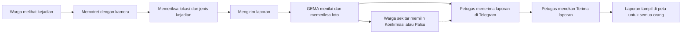

# GEMA (Gerakan Evaluasi dan Monitoring Ancaman)

GEMA adalah aplikasi web agar warga bisa melaporkan banjir, tanah longsor, dan kebakaran dengan cepat, dan agar petugas menerima laporan yang sudah disertai bukti. Warga cukup memotret kejadian. Sistem lalu membantu memeriksa foto itu, dan petugas yang memutuskan langkah berikutnya.


**Tim Labtek V Ijo Lumut Kya, Institut Teknologi Bandung**

- Juan Oloando Simanungkalit
- Ariel Sitorus Cornelius
- Naomi Azzahra
- Wa Ode Amerta Lambelu Jamaluddin
- Endda Tsa Azzahra Syaifur

## Daftar isi

- [Masalah yang ingin dijawab](#masalah-yang-ingin-dijawab)
- [Yang bisa dilakukan GEMA](#yang-bisa-dilakukan-gema)
- [Alur pengguna](#alur-pengguna)
- [Bagaimana GEMA menilai sebuah laporan](#bagaimana-gema-menilai-sebuah-laporan)
- [Teknologi yang dipakai](#teknologi-yang-dipakai)
- [Struktur folder](#struktur-folder)
- [Cara menjalankan](#cara-menjalankan)
- [Pengujian](#pengujian)
- [Seberapa akurat AI-nya](#seberapa-akurat-ai-nya)
- [Deploy](#deploy)
- [Dokumentasi lanjutan](#dokumentasi-lanjutan)

## Masalah yang ingin dijawab

Saat bencana terjadi, kabar tersebar cepat lewat foto. Masalahnya, foto lama sering dipakai ulang, foto bisa diedit, dan sulit memastikan lokasi serta waktu aslinya. Akibatnya petugas harus memeriksa banyak laporan satu per satu, dan warga bisa panik karena kabar yang keliru.

GEMA membantu di dua sisi. Warga mendapat jalur lapor yang singkat. Petugas menerima laporan yang sudah dilengkapi hasil pemeriksaan foto, waktu, lokasi, dan tanggapan warga sekitar.

## Yang bisa dilakukan GEMA

- Melapor tanpa daftar akun. Foto harus diambil langsung dengan kamera, tidak bisa dari galeri.
- Melihat laporan di peta, mencari berdasarkan nama kota atau jenis bencana, dan melihat di mana laporan paling banyak.
- Mendapat bantuan AI untuk membaca isi foto: ini banjir, longsor, atau kebakaran, dan seberapa parah kelihatannya.
- Mengetahui apakah sebuah foto pernah dipakai pada laporan lain.
- Membantu memeriksa laporan di sekitar Anda dengan memilih Konfirmasi atau Palsu.
- Bertanya ke chatbot GEMA AI tentang jumlah laporan, langkah aman saat bencana, atau cara kerja GEMA.
- Menyimpan laporan sementara di perangkat bila sinyal hilang, lalu mengirimnya saat aplikasi dibuka lagi.

## Alur pengguna



Laporan aktif langsung tampil di peta umum dengan label Belum dikonfirmasi sampai petugas menerimanya. Warga di sekitar lokasi (radius 500 meter) langsung diajak membantu memeriksa.

## Bagaimana GEMA menilai sebuah laporan

**GEMA menilai setiap laporan dari banyak tanda sekaligus.** Tanda-tanda itu dikumpulkan dan diserahkan kepada petugas yang mengambil keputusan akhir. Ibaratnya GEMA bekerja seperti asisten yang menyiapkan berkas lengkap, sehingga petugas bisa memutuskan dengan cepat.

Berikut yang diperiksa, berurutan, sejak foto diambil sampai laporan tiba di petugas.

**1. Foto harus langsung dari kamera.** Galeri tidak tersedia. Ini mencegah orang mengirim foto lama yang tersimpan di ponsel.

**2. Foto dirapikan dan diberi sidik jari.** Foto dikecilkan dan data tersembunyinya (seperti lokasi bawaan kamera) dibuang demi privasi. Lalu GEMA membuat dua sidik jari dari foto itu. Sidik jari pertama mengenali foto yang persis sama. Sidik jari kedua mengenali foto yang mirip, misalnya yang diperkecil atau disimpan ulang.

**3. Model AI melihat isi foto.** Model AI menjawab beberapa hal: apakah foto ini benar menunjukkan banjir, longsor, atau kebakaran; seberapa parah kelihatannya; dan seberapa yakin ia. Model juga diminta memberi tanda bila foto tampak seperti tangkapan layar, gambar buatan AI, hasil edit atau gabungan beberapa foto, atau berisi watermark media. Model hanya menyebut apa yang terlihat di foto, sementara waktu dan lokasi dicatat dari data pelapor.

**4. GEMA mencocokkan dengan laporan lain.** Sidik jari foto dibandingkan dengan semua laporan sebelumnya. Bila ada yang sama atau mirip, itu dicatat sebagai bukti. Bila fitur pencarian gambar internet diaktifkan, foto juga dicari di web untuk melihat apakah sudah beredar di tempat lain.

**5. GEMA memeriksa waktu dan kecocokan.** Laporan berlaku 12 jam sejak waktu kejadian. Waktu yang tidak jelas atau sudah lewat dicatat sebagai tanda risiko. Jenis bencana yang dipilih pelapor juga dibandingkan dengan hasil AI. Bila berbeda, itu dicatat.

**6. Laporan yang mirip digabung.** Beberapa laporan dengan jenis yang sama, jarak dekat (500 meter), dan waktu berdekatan (2 jam) dikelompokkan menjadi satu kejadian, supaya petugas melihat gambaran utuh.

**7. Warga sekitar ikut menilai.** Warga yang berada dalam radius 500 meter dapat memilih Konfirmasi atau Palsu. Suara ini hanya bukti tambahan. Bila Palsu jauh lebih banyak (minimal enam suara dan lebih banyak dari Konfirmasi), laporan yang belum diterima petugas ditahan, dan laporan yang sudah diterima ditandai untuk ditinjau ulang.

**8. Petugas memutuskan.** Petugas menerima ringkasan lewat Telegram: isi foto menurut AI, hasil pemeriksaan kemiripan foto, dan suara warga. Tanda risiko lengkap bisa dibuka lewat tombol Lihat bukti. Petugas menekan tombol Terima bila yakin, dan baru setelah itu laporan tampil di peta umum.

### Tanda yang dicari dan artinya

| Tanda | Artinya | Yang terjadi |
| --- | --- | --- |
| Foto sama atau mirip dengan laporan lain | Foto mungkin dipakai ulang | Dicatat sebagai bukti untuk petugas |
| Foto ditemukan di internet | Foto mungkin sudah beredar sebelumnya | Dicatat sebagai bukti untuk petugas |
| Tampak tangkapan layar, gambar buatan, atau hasil edit | Foto mungkin bukan hasil jepretan langsung | Dicatat sebagai petunjuk untuk petugas |
| Waktu kejadian tidak jelas atau sudah lewat 12 jam | Laporan belum bisa dianggap terbaru | Laporan ditahan sampai ditinjau |
| Jenis pilihan pelapor berbeda dari hasil AI | Ada yang tidak cocok | Dicatat sebagai tanda risiko |
| AI belum bisa menilai | Foto perlu dilihat langsung oleh petugas | Laporan tetap diteruskan agar cepat ditangani |
| Warga sekitar banyak memilih Palsu | Kejadian diragukan oleh yang ada di lokasi | Laporan ditahan atau ditinjau ulang |

## Teknologi yang dipakai

| Bagian | Teknologi | Untuk apa |
| --- | --- | --- |
| Tampilan aplikasi | Next.js, React, TypeScript, Tailwind CSS | Halaman yang dilihat warga: peta, form laporan, chatbot |
| Peta | Leaflet dan OpenStreetMap | Menampilkan laporan dan memilih lokasi |
| Server | FastAPI (Python) | Menerima laporan, menjalankan pemeriksaan, mengirim notifikasi |
| Database dan foto | Supabase | Menyimpan laporan, sesi pengguna, dan foto secara privat |
| Model AI | Model visi-bahasa (saat ini Gemini 3.1 Flash-Lite) | Membaca isi foto dan menjawab chatbot. Bisa diganti ke penyedia lain |
| Pencarian gambar internet | Google Cloud Vision (opsional) | Mencari foto yang sama di web |
| Notifikasi | Telegram Bot dan Web Push | Mengirim laporan ke petugas dan kabar ke warga |
| Hosting | Railway | Menjalankan aplikasi di internet |

## Struktur folder

```text
.
├── frontend/                  Aplikasi web (yang dilihat pengguna)
│   ├── src/app/               Halaman: peta, ringkasan, form laporan, panduan, hotline, tentang
│   ├── src/components/        Potongan tampilan: peta, kartu laporan, chatbot
│   ├── src/lib/               Pembantu: komunikasi ke server, lokasi, aturan tampilan
│   └── tests/                 Pengujian: unit/ (fungsi kecil) dan e2e/ (simulasi di peramban)
├── backend/                   Server
│   ├── app/                   Kode utama: pemeriksaan laporan, AI, notifikasi, chatbot
│   ├── migrations/            Langkah pembuatan tabel database (001 sampai 011)
│   ├── scripts/               Skrip bantu: data demo, cek kesiapan, webhook Telegram, evaluasi AI
│   └── tests/                 Pengujian: unit/, sql/, fixtures/ (foto uji), output/ (hasil evaluasi)
├── docs/
│   ├── fik-fair/              Spesifikasi, hasil pengujian, panduan operasional
│   ├── perencanaan/           Rencana, revisi, notulen, perubahan dari proposal
│   └── pitch/                 Naskah pitching dan panduan bisnis
├── LICENSE
└── README.md
```

## Cara menjalankan

Kebutuhan: Node.js 24, Python 3.11 ke atas, dan sebuah project Supabase.

**1. Siapkan database.** Di Supabase, buka SQL Editor lalu jalankan berkas di `backend/migrations/` berurutan dari 001 sampai 011. Aktifkan Anonymous sign-ins di menu Authentication. Detail ada di [panduan operasional](docs/fik-fair/operasional.md).

**2. Isi pengaturan.** Salin `backend/.env.example` menjadi `backend/.env`, dan `frontend/.env.example` menjadi `frontend/.env.local`. Isi alamat dan kunci Supabase, kunci model AI (`MODEL_API_KEY`), dan `RATE_LIMIT_SALT` (teks acak apa saja). Kunci rahasia hanya untuk server, jangan dimasukkan ke frontend.

**3. Jalankan server** dari folder `backend`:

```bash
python -m venv .venv
# Windows: .venv\Scripts\activate    Linux atau macOS: source .venv/bin/activate
pip install -r requirements.txt
python -m uvicorn app.main:app --reload --port 8000 --no-access-log
```

**4. Jalankan aplikasi web** dari folder `frontend`:

```bash
npm ci
npm run dev
```

Buka http://localhost:3000. Untuk memastikan server hidup, buka http://localhost:8000/health.

**5. Isi peta dengan data contoh (opsional).** Dari folder `backend`, jalankan perintah berikut, lalu tambahkan `DEMO_SHOWCASE=true` di `backend/.env` dan jalankan ulang server:

```bash
DEMO_MODE=true python -m scripts.seed_demo --showcase
```

Data contoh kedaluwarsa dalam 12 jam, jadi jalankan ulang sebelum demo. Jangan nyalakan `DEMO_SHOWCASE` pada layanan yang dipakai publik.

Skrip bantu lain, dari folder `backend`:

```bash
python -m scripts.check_readiness --live          # cek pengaturan dan tabel database
python -m scripts.set_telegram_webhook https://ALAMAT-SERVER
python -m scripts.evaluasi_ai                     # uji AI pada foto contoh
```

## Pengujian

Dari folder `backend`:

```bash
python -m unittest discover -s tests/unit -t .
python -m tests.unit.test_rules
python -m tests.unit.test_analyze
```

Dari folder `frontend`:

```bash
npm test
npm run lint
npm run build
npx playwright install chromium
npm run test:e2e
```

Uji database memakai PostgreSQL lokal sekali pakai lewat `backend/tests/sql/run-postgres.ps1`. Penjelasan tiap folder pengujian ada di [backend/tests/README.md](backend/tests/README.md).

## Seberapa akurat AI-nya

Model AI diarahkan dengan petunjuk (prompt) dan format jawaban terstruktur yang disesuaikan untuk banjir, longsor, dan kebakaran, sehingga hasilnya konsisten dan akurasinya tinggi. Angka laporan dan jawaban chatbot selalu diambil dari data nyata, bukan dikarang model.

Pada pengujian awal dengan 3 foto (satu banjir, satu kebakaran, satu longsor), ketiganya ditebak benar: akurasi 3 dari 3 dan F1 makro 1,0. Jawaban yang benar ditentukan lebih dulu oleh manusia sebelum foto dikirim ke model. Laporan lengkap dan cara mengulangnya ada di [backend/tests/output/hasil_evaluasi.md](backend/tests/output/hasil_evaluasi.md).

## Deploy

Aplikasi dipasang di Railway sebagai dua layanan: satu untuk folder `frontend/` dan satu untuk `backend/`. Pengaturan yang diawali `NEXT_PUBLIC_` dibaca saat pembuatan aplikasi, jadi frontend perlu dibangun ulang setelah pengaturan itu diganti. Di layanan nyata, isi `CORS_ORIGINS`, `PUBLIC_APP_URL`, `RATE_LIMIT_SALT`, dan kunci layanan di server, atur `DEMO_MODE=false`, dan pastikan semua migrasi database sudah dijalankan. Alamat demo: https://amusing-communication-production-abe3.up.railway.app/. Langkah pemeriksaan sebelum rilis ada di [panduan operasional](docs/fik-fair/operasional.md).

## Dokumentasi lanjutan

- [Indeks dokumentasi](docs/README.md)
- [Spesifikasi dan hasil pengujian FIK FAIR](docs/fik-fair/README.md)
- [Perubahan dari proposal penyisihan](docs/perencanaan/PERUBAHAN.md)
- [Naskah pitching](docs/pitch/PITCH_SCRIPT_4M30.md)

## Lisensi

Dirilis dengan lisensi MIT. Lihat berkas [LICENSE](LICENSE).
