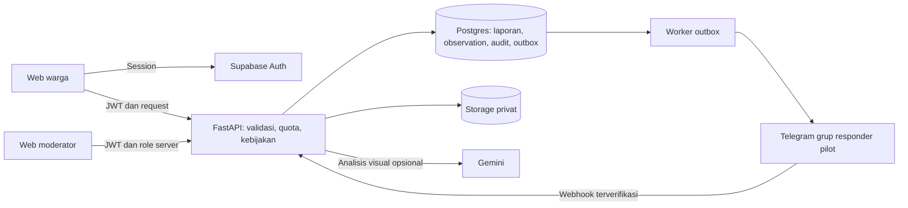

# Rencana implementasi GEMA untuk FIK FAIR 2026

Status: tahap A–D telah diimplementasikan di workspace pada 3 Oktober 2026; push opsional dan sinyal kemiripan juga tersedia. Aktivasi layanan serta sisa roadmap dijelaskan pada [hasil implementasi](../fik-fair/hasil-implementasi.md) dan [operasional](../fik-fair/operasional.md). Dokumen ini tetap menyimpan urutan dan kriteria desain sebagai acuan.

Mulai dari [masalah dan solusi](revisi.md). Kontrak otoritatif: [data/API](../fik-fair/data-dan-api.md), [kebijakan bukti](../fik-fair/kepercayaan-dan-notifikasi.md), [UI](ui.md), dan [design system](../fik-fair/design-system.md).

## Prinsip pengerjaan

Pertahankan stack yang ada: Next.js/React/TypeScript, Tailwind, Leaflet, FastAPI, Supabase, Gemini, dan Telegram. Model yang dibaca saat review adalah `gemini-3.1-flash-lite`; jangan mengambil nama model lama dari README sebagai konfigurasi aktual. AI tetap alat bantu, keputusan publikasi dan akses berada di backend.

Jangan memulai dari push notification atau menambah agent AI. Pekerjaan pertama adalah membuat informasi dan otorisasi benar. Gunakan feature flag untuk alur baru sampai kontrak dan test lulus. Sebelum mengubah kode frontend, baca dokumentasi Next.js lokal sesuai `frontend/AGENTS.md`.

Arsitektur memakai layanan yang sudah ada; observation, audit, dan outbox sudah ditambahkan. Layanan luar belum diaktifkan oleh perubahan workspace ini.

## Tahapan dan dependensi

| Tahap | Deliverable | Masalah | Dependensi dan gate |
| --- | --- | --- | --- |
| A: kejelasan dan baseline | Tracker akurat; error berbeda dari kosong; data demo terpisah; inventaris test | FIX-06, 07, 08, 14, 17, 18 | Bisa dimulai segera; tidak membuka fitur moderasi publik |
| B: fondasi kepercayaan | JWT, role, quota, status bukti, waktu pengamatan, audit, tidak auto-hide | FIX-01–05, 14 | Auth dan migrasi lulus sebelum menerima mutasi observation/moderasi |
| C: fitur inti komunitas | Notice dalam aplikasi, tiga jawaban, sumber/waktu, moderator review, refresh | FIX-12, 13, 15 | B selesai; seluruh notice memakai aturan visibilitas dan freshness |
| D: ketahanan input/operasi | Draft sebelum AI, manual fallback, outbox, upload bounded, cleanup | FIX-09–11, 16, 18 | Backend boleh dikerjakan sejajar secara tugas oleh tim; publikasi memerlukan B |
| E: perluasan terukur | Push, deteksi kemiripan, grouping, mitra resmi, evaluasi AI | FIX-03 lanjutan | Pilot C/D memberi bukti; izin notifikasi dan tata kelola mitra tersedia |

Urutan ini adalah urutan dependensi, bukan janji seluruh tahap selesai sebelum deadline. Tahap D dapat disederhanakan menjadi retry manual dan fallback AI dahulu; tandai offline yang ditunda sebagai roadmap.

## A. Koreksi perilaku yang menyesatkan

1. `frontend/src/lib/tracker-acceptance.ts`, layar tracker, dan detail: ubah arti `ACCEPTED` menjadi diterima responder. Hapus inferensi berangkat.
2. `backend/app/api/nearby.py`: kembalikan ringkasan kandidat dari query yang sama; frontend tidak mencari ulang kandidat di 50 data feed.
3. Dashboard warga/pengelola dan provider laporan: tampilkan loading, gagal, kosong, stale, serta waktu pembaruan secara terpisah.
4. Terapkan filter non-demo dan usia laporan yang sama pada feed, nearby, density, statistik, dan konteks chat. Riwayat tetap tersedia melalui jalur yang diberi label.
5. Detail held melalui endpoint privat; halaman publik menampilkan status ketersediaan generik, bukan membuka alasan sensitif.

Selesai jika T-03, T-04, T-08, T-10, dan T-12 pada [pengujian](../fik-fair/pengujian.md) lulus.

## B. Auth, spam, dan model bukti

1. Warga: anonymous sign-in Supabase; server memvalidasi signature, issuer, audience, expiry, dan subject. Jangan menerima user ID dari body/Bearer mentah.
2. Pengelola: akun permanen dan role server. Periksa role pada baca privat, moderasi, dan pengaturan, bukan hanya menu.
3. Tambah migrasi setelah 004 untuk status baru, waktu pengamatan, sumber foto, AI nullable, audit, observations, abuse reports, dan outbox. Urutan/detail di data-dan-api.md.
4. Ubah fungsi vote agar jumlah pengaduan hanya memicu antrean review. Hentikan penulisan `disputed_hidden` otomatis sebelum rollout.
5. Tambah quota di penyimpanan bersama agar berlaku pada restart/multiworker. Jalur baca publik tidak bergantung login; mutasi perlu auth. Kegagalan layanan quota menghentikan mutasi mahal, tetapi tidak memblokir akses informasi keselamatan yang sudah tersedia.
6. Klasifikasikan risiko: waktu tidak diketahui, foto diulang, lokasi manual, atau AI uncertain menjadi petunjuk review; bukan vonis hoax otomatis.
7. Catat setiap keputusan dengan aktor, alasan, waktu, dan versi record. Role tidak pernah berasal dari metadata yang bisa diedit sendiri.

Selesai jika T-01, T-02, T-05, T-06, dan T-07 lulus; backend menolak token palsu dan mutasi pengelola oleh warga.

## C. Pemberitahuan radius dan pengamatan warga

1. `/nearby` mengembalikan daftar terbatas kandidat beserta jarak, waktu, status bukti, dan jenis notice; pengurutan jelas, bukan “terdekat selalu paling berbahaya”.
2. Frontend meminta lokasi secara kontekstual. Jika ditolak, pengguna memilih area pemantauan; lokasi pilihan tidak dianggap posisi fisik.
3. Tampilkan “Ada laporan ... di sekitar Anda”, bukan pernyataan kejadian pasti. Laporan held tidak masuk notice publik, tetapi tersedia bagi moderator.
4. Tambah form observation: `seen`, `not_observed`, `unsure`; sumber `direct`/`secondhand`, waktu pengamatan, catatan opsional. Foto pendukung opsional ditunda dari MVP agar storage tetap sederhana.
5. Satu observation terkini per akun/laporan. Update tidak menambah jumlah orang; jawaban pelapor tidak dihitung sebagai pengamatan warga lain.
6. Tampilkan agregat dengan label sumber. Jangan mengubah `verification_status` berdasarkan count. Keterangan “Saya belum tahu” tidak menjadi suara menolak.
7. Bangun antrean moderator: laporan meragukan, pengaduan, konflik pengamatan, detail privat, dan keputusan beralasan.
8. Refetch feed/detail setelah publish/observation/moderasi; polling saat layar aktif dengan backoff. Dedup notice per laporan/perubahan material dan cooldown.

Selesai jika T-07, T-09, T-10, T-11, dan uji U-01–U-04 lulus. Jangan menyebut notice dalam aplikasi sebagai web push.

## D. Draft, AI, outbox, dan koneksi rendah

1. Bentuk alur draft baru: validasi input/media → simpan draft → analisis AI opsional → review → submit. Pertahankan adaptor `/analyze` untuk client lama selama transisi.
2. AI timeout/unavailable/uncertain: draft tetap ada; beri pilihan lanjut manual yang masuk review. Invalid visual tidak menghapus draft, tetapi tidak diterbitkan sebagai hasil AI relevan.
3. Upload: batasi body di server/proxy, baca chunk dengan hard limit, cek MIME/magic bytes/decode/dimensi, hilangkan metadata yang tidak diperlukan sebelum penyimpanan publik/preview. Kompresi client membantu UX, tidak mengganti validasi server.
4. Offline: simpan draft di IndexedDB dengan client UUID. Sync saat aplikasi dibuka dan jaringan tersedia; jangan menjanjikan background sync universal. Sediakan retry dan hapus draft.
5. Kunci idempotency per user dan operasi submit. Simpan hash payload; key sama dengan payload berbeda → 409. Retry identik memberi hasil yang sama tanpa Telegram baru.
6. Outbox di transaksi publish: event triase privat. Worker memproses dengan lease/claim atomik, retry/backoff, dan batas percobaan. Ambigu setelah Telegram menerima tetapi koneksi putus → `unknown`, perlu rekonsiliasi.
7. Webhook Telegram tetap memvalidasi secret/group/message/report, ditambah allowlist user responder. Penerimaan dipetakan ke identitas responder server, dicatat dalam audit.
8. Cleanup draft/media mengikuti retention. Hapus orphan hanya setelah memastikan tidak direferensikan; operasi cleanup retryable dan tercatat.

Selesai jika T-13–T-17 lulus. Persist laporan harus tetap berhasil walau Telegram gagal; UI membedakan keberhasilan publish dengan keberhasilan pengiriman triase.

## E. Perluasan dan roadmap

- Push: service worker, subscription, VAPID/server push, unsubscribe, preference, dan freshness telah dibuat; provider nyata perlu dikonfigurasi dan diuji staging. Tidak mengandalkan GPS background browser.
- Kemiripan: SHA-256 persis dan dHash 64-bit dengan jarak Hamming ≤5 sudah menjadi sinyal review; belum dievaluasi pada dataset foto edit. Similarity tidak membuktikan kebohongan dan hanya mengenali gambar yang pernah tersimpan.
- Grouping: kaitkan beberapa laporan ke incident setelah ada aturan jenis, ruang, waktu, merge/split, dan audit. Jangan menghitung laporan sebagai jumlah kejadian unik sebelum ini tersedia.
- Mitra: validasi alur responder, area operasional, SOP, kontak, dan rute evakuasi bersama pihak yang berwenang.
- Evaluasi: dataset visual berlabel, analisis false positive/negative, serta observasi kegunaan di komunitas. Tidak mengganti target akurasi dengan angka tanpa pengukuran.

## Strategi migrasi dan peluncuran

1. Backup sesuai prosedur proyek; uji migrasi pada database staging berisi fixture legacy, bukan langsung pada data live.
2. Tambahkan field nullable dan backend yang bisa membaca legacy; deploy UI baru setelah endpoint siap.
3. Aktif legacy diisi `verification_status=unconfirmed`. Tanpa waktu pengamatan yang dapat dipertanggungjawabkan, tidak diberi notice baru; data demo masuk namespace/mode demo.
4. `disputed_hidden` → `held` dengan alasan “migrasi pengaduan lama”, bukan refuted. Moderator meninjau kembali.
5. Identitas UUID lokal lama tidak bisa diklaim aman hanya dengan mengirim UUID. Arsipkan data demo atau lakukan pemulihan pemilik dengan bukti yang terpisah; jangan membuka endpoint takeover.
6. Aktifkan feature flag komunitas hanya setelah gate auth, moderasi, dan notice lulus. Jika perlu rollback, matikan feature flag; jangan mengaktifkan kembali token mentah atau auto-hide lama.
7. Amati quota reject, error auth, latency, antrean moderasi, umur outbox, dan failure sync. Log tidak memuat token, service key, atau koordinat privat lengkap.

## Pembagian kerja tim yang disarankan

| Bidang | Output reviewable |
| --- | --- |
| Backend/auth | JWT, role, quota, kontrak endpoint, test akses |
| Data/operasi | Migrasi, audit, outbox, cleanup, runbook kegagalan |
| Frontend | State UI, report flow, observation, moderator, design tokens |
| Riset/produk | Pilot, pengujian pengguna, metrik, revisi bahasa |
| Submission | Proposal, deck, video ≤3 menit, Devpost, bukti kontribusi |

Ini pembagian tanggung jawab bagi tim yang terdaftar, bukan perubahan susunan anggota. Pada tim empat orang, gabungkan riset/submission.

## Definition of done

- Kontrak data/API, migrasi, UI, dan dokumentasi konsisten.
- Tidak ada akses privat tanpa role server, auto-hide berdasarkan jumlah vote, atau label keberangkatan palsu.
- Acceptance test yang relevan lulus; failure lama diperbaiki atau penghapusan test usang dijelaskan.
- Smoke test staging dilakukan pada alur warga–pengelola–responder; test otomatis tidak mengirim pesan ke pihak luar.
- Uji pengguna dan keterbatasan ditulis apa adanya; demo dan data nyata terpisah.
- Fitur belum selesai tetap tertulis sebagai roadmap; submission hanya mengklaim yang berhasil didemonstrasikan.
