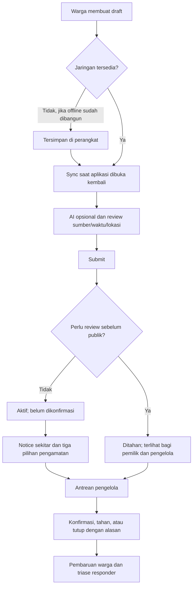

# Spesifikasi UI GEMA

Status: acuan desain alur yang telah diterapkan pada fitur inti. Bukti dan batas cakupan: [hasil implementasi](docs/fik-fair/hasil-implementasi.md). Acuan visual: [design system](docs/fik-fair/design-system.md). Arti status: [data dan API](docs/fik-fair/data-dan-api.md).

## Navigasi

Warga: Beranda, Buat Laporan, Laporan Saya, Panduan/Kontak. Pengelola: antrean review dan detail privat setelah login berizin. Mode demo diberi label pada seluruh layar, tidak menjadi cara masuk pengelola produksi.

Beranda menawarkan **Daftar / Peta** yang sama-sama mudah ditemukan. Daftar bisa dipakai tanpa memahami warna peta atau mengoperasikan marker. Pada desktop, panel daftar/detail dapat berdampingan dengan peta; layar kecil memakai satu panel utama dengan navigasi yang jelas.

## Alur utama



Triase privat dapat dimulai setelah submit, termasuk pada held berindikasi mendesak. Diagram tidak berarti triase harus menunggu keputusan akhir moderator.

## 1. Beranda warga

Urutan konten mobile:

1. Header GEMA dan tindakan Buat Laporan.
2. Area pemantauan: lokasi perangkat/area pilihan, usia lokasi, ubah area.
3. Pemberitahuan sekitar: maksimum tiga kartu yang relevan.
4. Status data: waktu update, refresh, dan gangguan bila ada.
5. Toggle Daftar/Peta, filter jenis, kartu laporan.
6. Panduan dan kontak yang tidak tergantung keberhasilan query laporan.

Jangan meminta permission lokasi/notifikasi langsung saat pertama membuka halaman. Beri tombol “Gunakan lokasi saya” dengan alasan kegunaan. Jika ditolak, sediakan pilih area manual dan tetap tampilkan daftar umum.

Wireframe konseptual, bukan gambar hasil implementasi:

```text
[GEMA]                          [Buat laporan]
[Area dipantau: Lingkungan A]    [Ubah]
[Ada laporan kebakaran • 400 m]
[Belum dikonfirmasi • diamati 14.10 WIB]
[Lihat laporan]  [Beri pengamatan]
[Diperbarui 14.12 WIB]           [Refresh]
[Daftar | Peta]  [Semua jenis]
[Kartu laporan + sumber/status + waktu]
[Panduan]                       [Kontak]
```

### State data wajib

| State | Tampilan |
| --- | --- |
| Loading awal | Skeleton + “Memuat laporan”; jangan menampilkan nol laporan atau nihil bahaya |
| Ready-data | Data dan waktu pembaruan |
| Ready-empty | “Belum ada laporan aktif yang sesuai area ini”; tambahkan bahwa ini bukan jaminan kondisi aman |
| Error tanpa cache | “Data belum dapat dimuat” + Coba lagi; kontak/panduan tetap tersedia |
| Error dengan cache | Data terakhir + “Belum diperbarui, terakhir ...”; jangan memakai cache sebagai kondisi terkini |
| Lokasi tidak tersedia | Pilih area; daftar umum dapat dibaca |
| Lokasi sudah lama | Minta perbarui; hapus klaim “sekitar posisi Anda” |
| Offline | “Anda sedang offline”; hanya tampilkan data cache bertanggal jika fitur cache tersedia |

## 2. Membuat laporan

Langkah dibuat singkat, dapat kembali tanpa kehilangan input:

| Langkah | Input/aksi | Aturan |
| --- | --- | --- |
| Bukti | Ambil/pilih foto atau lanjut manual | Pilihan manual muncul jika tersedia; foto gallery tidak otomatis ditolak |
| Konteks | Jenis menurut pelapor, diamati kapan, sumber foto/info | Pisahkan waktu foto, waktu pengamatan, dan waktu kirim; “tidak tahu” diperbolehkan tetapi masuk review |
| Lokasi | GPS atau titik manual, label area | Terangkan lokasi kejadian dapat berbeda dari lokasi perangkat; demo tidak menjadi fallback produksi |
| Analisis | Indikasi visual AI, atau unavailable/uncertain | “AI mengenali tanda ..., belum membuktikan waktu dan lokasi kejadian” |
| Review | Ringkasan seluruh input dan status yang mungkin | Tampilkan informasi yang kurang; jangan memberi badge verified |
| Submit | Kirim sekali dengan progress | Nonaktifkan double click; retry menggunakan idempotency yang sama |

Waktu default “sekarang” harus terlihat dan dapat diganti; jangan diam-diam menyalin analyzedAt/published_at sebagai observed_at. Kamera baru juga dapat memotret layar berita lama.

Saat AI gagal: “Analisis belum tersedia. Draft Anda tetap tersimpan. Anda dapat melanjutkan sebagai laporan yang perlu ditinjau.” Saat upload terlalu besar: tawarkan kompresi client/retry; input lain tetap tersimpan.

Hasil submit:

- Active: “Laporan tercatat. Status: belum dikonfirmasi.”
- Held: “Laporan tersimpan dan sedang ditinjau. Belum ditampilkan kepada warga sekitar.”
- Offline lokal: “Draft tersimpan di perangkat. Belum terkirim.” Hanya jika IndexedDB benar-benar berhasil.
- Error: data tetap tersedia untuk retry; tidak menampilkan sukses palsu.

## 3. Detail laporan

Status bukti dan waktu pengamatan tampil sebelum hasil AI. Isi: kategori menurut pelapor, area, ringkasan aman, status, waktu pembaruan, pengamatan warga, keputusan pengelola jika ada, dan status responder.

Untuk laporan unconfirmed, marker/card berwarna netral; tidak menggambar zona bahaya pasti dari hasil foto. Radius jangkauan informasi hanya tampil dengan label eksplisit. Detail privat owner/moderator memakai endpoint berbeda.

| Bagian | Contoh teks |
| --- | --- |
| Status bukti | Belum dikonfirmasi / Sedang ditinjau / Dikonfirmasi pengelola komunitas |
| AI | Indikasi visual AI: tinggi. Ini bukan penilaian risiko resmi. |
| Pengamatan | 3 akun melaporkan melihat langsung; 1 pengamatan bertentangan |
| Sumber tidak langsung | 2 akun memberi informasi dari orang lain |
| Waktu | Diamati 14.10 WIB • diperbarui 14.20 WIB |
| Penutupan | Ditutup: kejadian selesai / informasi kedaluwarsa / informasi tidak sesuai |

Tombol utama “Beri pengamatan” tersedia untuk laporan aktif yang belum expired. Tombol terpisah “Laporkan masalah pada informasi ini”; jangan mencampur pengaduan dengan jawaban tidak melihat.

Foto asli tidak otomatis tersedia pada detail publik. Preview yang sudah diizinkan/diredaksi boleh tampil; jangan membuka signed URL original kepada siapa saja hanya karena memiliki report ID.

## 4. Form pengamatan sekitar

Pertanyaan: **Apakah Anda mengetahui kondisi di lokasi tersebut?**

- Saya melihat tanda kejadian.
- Saya berada di lokasi kejadian dan tidak melihat tanda tersebut.
- Saya belum tahu / tidak bisa memastikan.

Gunakan radio group berlabel, lalu sumber langsung/tidak langsung, waktu, dan catatan. Untuk jawaban negatif, sumber direct wajib dan tampilkan pernyataan “Saya memang berada di lokasi yang dimaksud pada waktu pengamatan ini”; jika tidak bisa menyatakan, sarankan unsure dengan catatan informasi warlok. Koordinat perangkat tidak dikirim untuk sumber secondhand. Tunggu jawaban sebelumnya dimuat sebelum mengaktifkan input agar respons terlambat tidak menimpa jawaban pengguna. Pengguna tidak perlu datang ke lokasi untuk menjawab.

Checkbox/pernyataan client adalah deklarasi, bukan validasi posisi. API menghitung proximity sesuai kebijakan; pengguna tanpa GPS tetap bisa memberi informasi untuk review. Untuk unsure, jangan memaksa sumber/waktu palsu.

Setelah kirim: “Pengamatan Anda tersimpan. Ini membantu peninjauan laporan.” Tampilkan jawaban sendiri dengan Ubah/Cabut. Hindari ucapan “Terima kasih sudah memvalidasi berita” yang menganggap keputusan selesai.

## 5. Laporan saya dan tracker

| Data server | Label UI |
| --- | --- |
| Draft lokal | Belum terkirim, tersimpan di perangkat |
| Draft server | Draft tersimpan, belum diajukan |
| Active unconfirmed | Laporan tercatat, belum dikonfirmasi |
| Held | Sedang ditinjau; lihat permintaan informasi jika ada |
| PENDING | Menunggu penerimaan responder |
| ACCEPTED | Laporan diterima responder |
| Closed | Ditutup dengan alasan dan waktu |

Tidak menampilkan “Petugas menuju lokasi” tanpa aksi keberangkatan. Help vote lama, jika masih ditampilkan, diberi judul pengamatan bantuan dan tidak menjadi status kejadian. Laporan sendiri yang held harus tetap dapat dibuka melalui jalur pemilik.

## 6. Dashboard pengelola

Login permanen dan role server wajib. Daftar memuat alasan antrean, waktu, status bukti, indikasi visual, dan usia laporan. Filter: perlu review, konflik pengamatan, pengaduan, held, confirmed, closed.

Detail privat: foto sesuai izin, lokasi rinci seperlunya, sumber/waktu, riwayat pengamatan, pengaduan, audit, dan status pengiriman triase. Aksi memerlukan alasan, menampilkan perubahan sebelum disimpan, dan expected_version.

Konflik versi: “Laporan berubah sejak Anda membukanya. Muat ulang sebelum membuat keputusan.” Tidak silently overwrite. Gagal memuat antrean tidak berubah menjadi dashboard nol kasus.

Aksi destruktif terhadap publikasi seperti refute/hold menampilkan ringkasan keputusan dan alasan untuk diperiksa dalam form. Ini kontrol produk, bukan permintaan izin tambahan kepada pemilik repository.

## 7. Panduan, About, dan demo

Hapus statistik simulasi dari klaim dampak nyata; jika digunakan pada demo, label dekat angka. Titik kumpul/rute contoh diberi label simulasi dan tidak dipakai sebagai navigasi keselamatan nyata. FAQ menyebut AI membaca foto sesuai implementasi, bukan deskripsi jika tidak diproses model.

Tidak ada perubahan daftar kontak tanpa sumber yang dapat diverifikasi. Jangan memuat dokumen teknis atau kata internal seperti JWT/outbox pada layar warga.

## Kriteria penerimaan UI

- Warga membedakan laporan, pengamatan, dan konfirmasi pengelola.
- Tiga jawaban tersedia dan unsure tidak dihitung sebagai bantahan.
- Radius dan lokasi manual memiliki label yang benar.
- Error/stale/loading/empty dapat dibedakan pada warga dan pengelola.
- Keyboard, fokus dialog, daftar alternatif peta, zoom 200%, dan ukuran sentuh diperiksa.
- Tidak ada data demo tanpa penanda atau badge yang hanya menyampaikan makna melalui warna.
